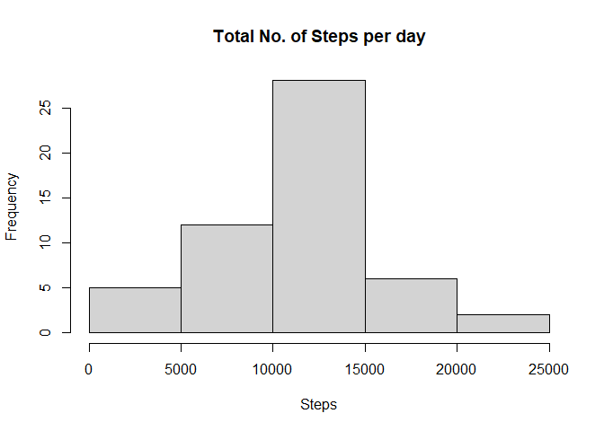
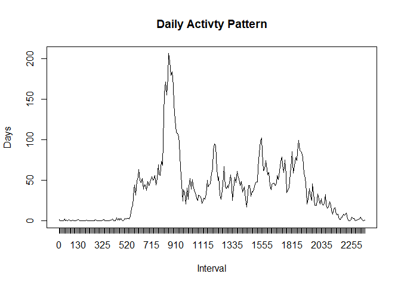
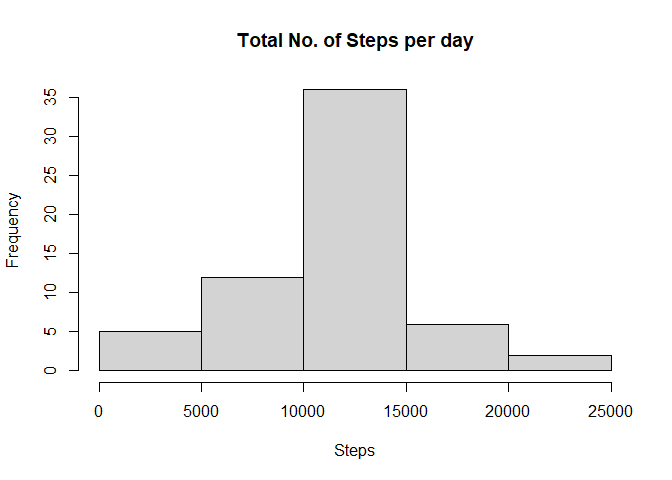
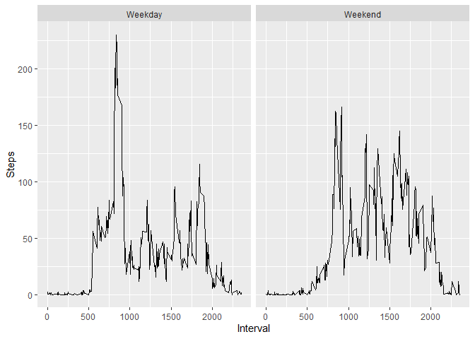

Project Assignment 
=================
We are first going to load the Activity Monitoring Data


```r
activity <- read.csv("activity.csv", na.strings="NA")
```

Histogram for number of steps taken each day 


```r
library(dplyr)
totalsteps <- activity %>% group_by(date) %>% summarize(sum(steps,na.rm=FALSE))
hist(totalsteps$`sum(steps, na.rm = FALSE)`, main = "Total No. of Steps per day", xlab = "Steps")
```

<!-- -->


Calculating average daily activity pattern 


```r
library(dplyr)
sumByDay <- activity %>% group_by(date) %>% summarize(total_steps=sum(steps),
mean_steps=mean(steps), median_steps=median(steps[steps>0]))
```


```r
activityPattern <- tapply(activity$steps, activity$interval, mean, na.rm = TRUE)
xnames <- names(activityPattern)
{plot(activityPattern, xaxt="n", type="l", main = "Daily Activty Pattern", xlab = "Interval", ylab = "Days" )
axis(1, at=1:length(xnames), label=xnames)}
```

<!-- -->

```r
max(activityPattern)
```

```
## [1] 206.1698
```

```r
which.max(activityPattern)
```

```
## 835 
## 104
```

The total number of missing values in the dataset 


```r
sum(is.na(activity$steps))
```

```
## [1] 2304
```

Replacing the missing values with the mean 


```r
activity$steps<-ave(activity$steps,activity$interval,FUN=function(x) 
  ifelse(is.na(x), mean(x,na.rm=TRUE), x))
```


Histogram for total number of steps taken per day 


```r
totalsteps <- activity %>% group_by(date) %>% summarize(sum(steps,na.rm=FALSE))
hist(totalsteps$`sum(steps, na.rm = FALSE)`, main = "Total No. of Steps per day", xlab = "Steps")
```

<!-- -->

```r
sumByDay <- activity %>% group_by(date) %>% summarize(total_steps=sum(steps),
mean_steps=mean(steps), median_steps=median(steps[steps>0]))
```

Creating a new factor variable for weekdays and weekends


```r
library(lubridate)
activity$date<-  ymd(activity$date)
activity$Day <- weekdays(activity$date)
activity$Day[grepl("Saturday|Sunday", activity$Day)] <- "Weekend"
activity$Day[grepl("Monday|Tuesday|Thursday|Friday|Wednesday", activity$Day)] <- "Weekday"
```

Panel plot comparing the average number of steps taken per 5-minute interval across weekdays and weekends


```r
library(ggplot2)
MeanByDay <- activity %>% group_by(interval, Day) %>% summarise(mean_steps=mean(steps))
g <- ggplot(MeanByDay, aes(interval, mean_steps)) 
g + geom_line() + facet_grid(.~Day) + labs(x = "Interval", y = "Steps")
```

<!-- -->


